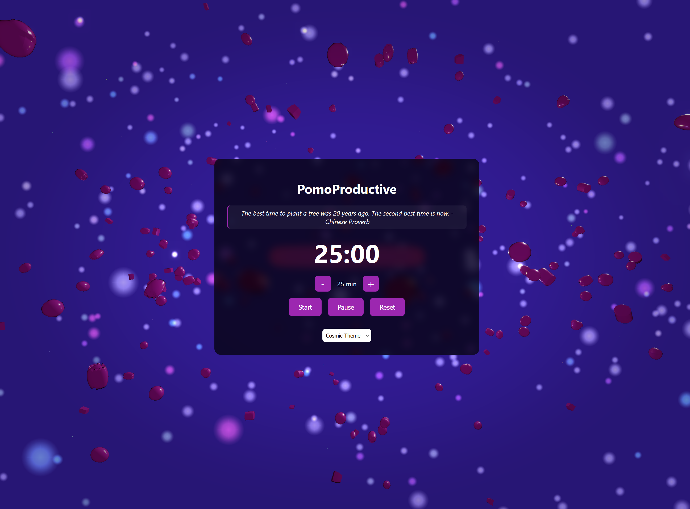

# PomoProductive - WebGL Pomodoro Timer

A beautiful and immersive Pomodoro timer featuring stunning WebGL-based 3D graphics with dynamic gemstones, stars, and visual effects. Built with Three.js, this application combines productivity with aesthetic appeal.

 *(Add your screenshot here)*

## Features

- **Interactive 3D Environment**
  - Dynamic gemstone particles with realistic physics
  - Ambient star field with twinkling effects
  - Responsive timer ring with flowing energy effects
  - Beautiful post-processing effects and bloom

- **Timer Functionality**
  - Customizable duration (5-60 minutes)
  - Start, pause, and reset controls
  - Visual progress indication through 3D animations
  - Audio notification when timer completes

- **Theme Customization**
  - Four beautiful themes:
    - Default Theme
    - Ocean Theme
    - Forest Theme
    - Cosmic Theme
  - Dynamic color transitions
  - Theme-responsive 3D elements

- **Motivational Features**
  - Rotating inspirational quotes
  - Dynamic visual feedback
  - Engaging particle animations

## Technologies Used

- Three.js (r132)
- WebGL
- Custom GLSL Shaders
- HTML5/CSS3
- JavaScript

## Getting Started

1. **Prerequisites**
   - A modern web browser with WebGL support
   - No additional installation required

2. **Installation**
   ```bash
   # Clone the repository
   git clone https://github.com/yourusername/PomoProductive.git

   # Navigate to the project directory
   cd PomoProductive

   # Open index.html in your browser
   # You can use any local server, for example:
   python -m http.server 8000
   ```

3. **Usage**
   - Open the application in your web browser
   - Use the +/- buttons to adjust timer duration
   - Click 'Start' to begin the timer
   - Use 'Pause' to temporarily stop
   - Use 'Reset' to restart the timer
   - Select different themes from the dropdown menu

## Performance Considerations

- The application uses hardware acceleration through WebGL
- Optimized particle systems and shader effects
- Adaptive quality based on device capabilities
- Fallback to basic UI if WebGL is not available

## Browser Compatibility

- Chrome 90+
- Firefox 88+
- Safari 14+
- Edge 90+
- Opera 76+

## Contributing

Contributions are welcome! Please feel free to submit a Pull Request.

1. Fork the project
2. Create your feature branch (`git checkout -b feature/AmazingFeature`)
3. Commit your changes (`git commit -m 'Add some AmazingFeature'`)
4. Push to the branch (`git push origin feature/AmazingFeature`)
5. Open a Pull Request

## License

This project is licensed under the MIT License - see the [LICENSE](LICENSE) file for details.

## Acknowledgments

- Three.js community for the amazing 3D graphics library
- Inspiration from traditional Pomodoro timers
- Contributors to the WebGL and shader effects

## Author

Your Name - [Your Website/GitHub Profile]

---

Made with ❤️ and WebGL
